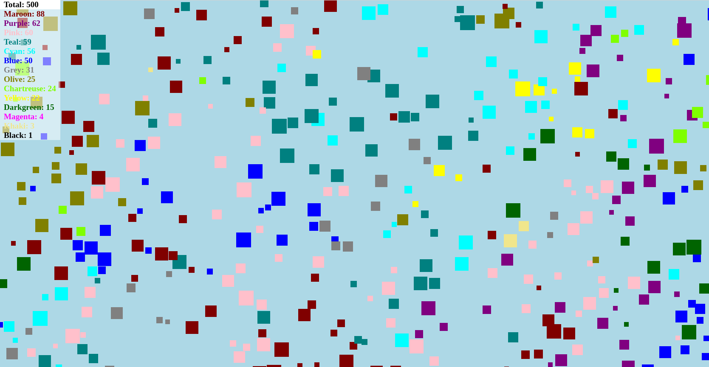

<h1>BouncyBlocks</h1>
<h3>Description</h3>

I coded this when I had some down-time at work to keep my JavaScript skills sharp. 
It is not a game per-say, but is very mesmerizing to watch. When two boxes collide, there 
is a 50-50 chance that both blocks will become the color of either. The default resolution 
is set to 1920x1080. If that is your max monitor resolution, you can press F11 to full-screen
it. Doing this will reveal a "<b>Drop Virus</b>" button at the bottom of the screen which you
will find, has an interesting effect. 

Even though this was written recently, the code is very sloppy as I never really bothered 
to clean it up. I just got it working and ran with it. Just clone and run the .html file in any browser.
Feel free to mess with any of the variable setting at the beginning of the file. Enjoy!

<h3>Screen Shot</h3>

